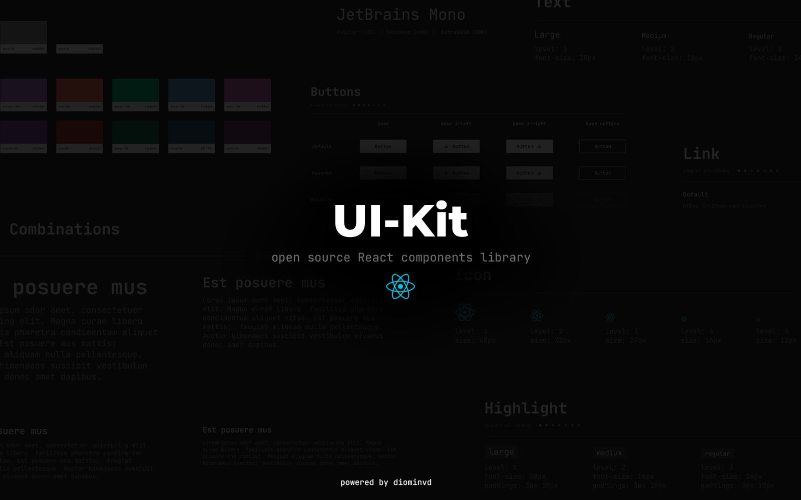

# Guide to using the ui-kit

This library has a basic set of components for quickly creating user interfaces. The project is completely open source and can be supported both by me personally and by the community by making my own changes.

> [!TIP]
> The library is available for download from the [npm repository](https://www.npmjs.com/package/@diominvd/ui-kit)

## Installation & Get started

To install the library, run the following command in your project directory:

```bash
npm i @diominvd/ui-kit --save
```

Now you can use the components from the library in your project:

```tsx
import { Headline, Text } from '@diominvd/ui-kit';

export const MyComponent: React.FC<ComponentInterface> = ({ ...props }) => {
  return (
    <>
      <Headline level={1} color='light' weight='extrabold'>Some Headline</Headline>
      <Text level={1} color='gray' weight='regular'>Some text can be placed here</Text>
    </>
  )
}
```

## Component Guide

- [Button](./lib/components/Button/README.md)
- [Headline](./lib/components/Headline/README.md)
- [Highlight](./lib/components/Highlight/README.md)
- [Icon](./lib/components/Icon/README.md)
- [Link](./lib/components/Link/README.md)
- [Text](./lib/components/Text/README.md)

---

Current version 1.0.2
